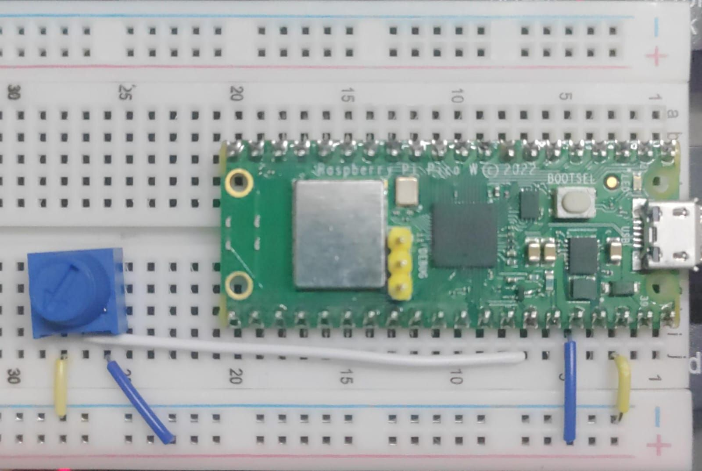
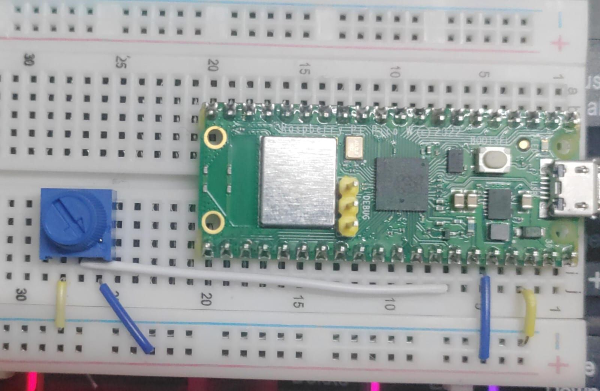

```python
import machine;
from time import sleep;

potPin = 28;

myPot = machine.ADC(potPin)
# ADC: Analogue Digital Convertor

while True:
    potVal = myPot.read_u16()
    print(potVal)
    sleep(0.5)

```  
##### Preview:  
  
#### Output:  
```Terminal
304
288
288
288
288
```  
getting lowest reading because the knob is all down
##### Preview:  
  
#### Output:  
```Terminal
65535
65535
65535
65535
```  
getting highest reading because the knob is all up

2 ^ 16 = `65536`  

