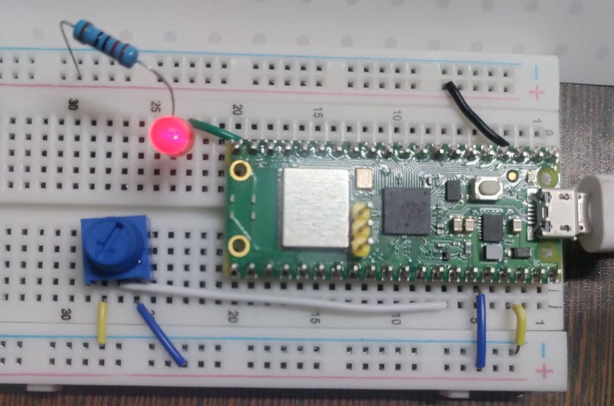
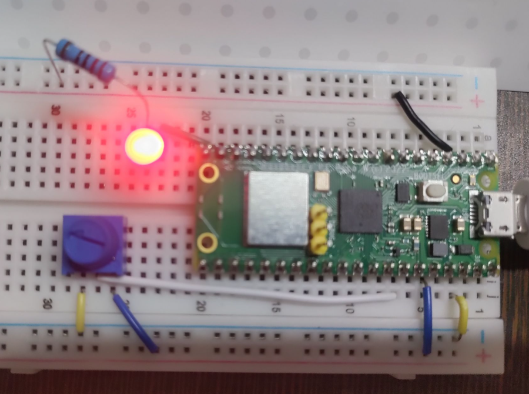
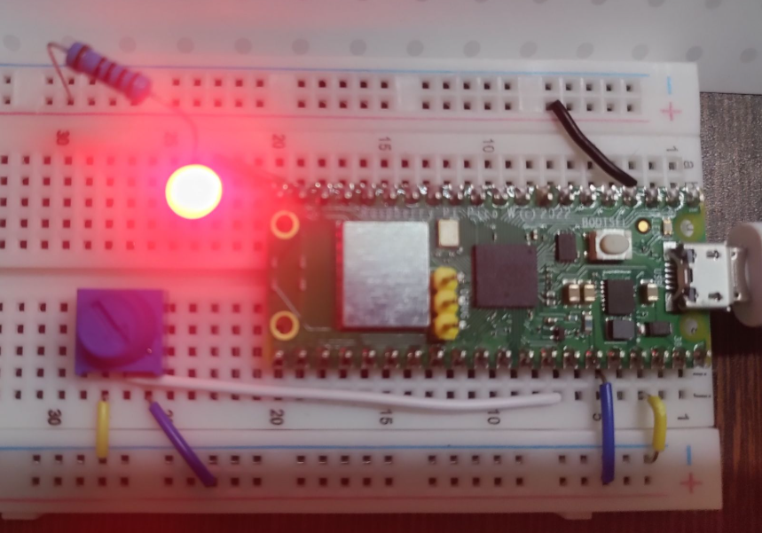

```python
from machine import Pin, PWM, ADC;
from time import sleep;

# ADC: Analog-to-Digital Converter  
# PWM: Pulse Width Modulation.

# 1. Pin Setup
ledPinNum = Pin(15);
myLed = PWM(ledPinNum);
myLed.freq(1000); # Set a frequency of 1kHz so the eye doesn't see flickering

# 2. Potentio Meter Setup
PotentioMeterPinNum = 28;
myPotentioMeter = ADC(PotentioMeterPinNum);

while True:
    potVal = myPotentioMeter.read_u16(); # Read the 16-bit value (0 to 65535)
    myLed.duty_u16(potVal); 
    
    
    # Calculate and print percentage just for your reference
    percentage = (potVal / 65535) * 100
    print(f"Intensity: {percentage:.2f}%")
    
    sleep(0.1) # Reduced sleep time for smoother, more responsive dimming
```  

##### Preview:  
  
  
  