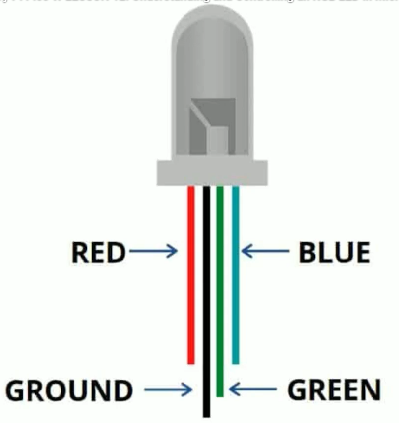
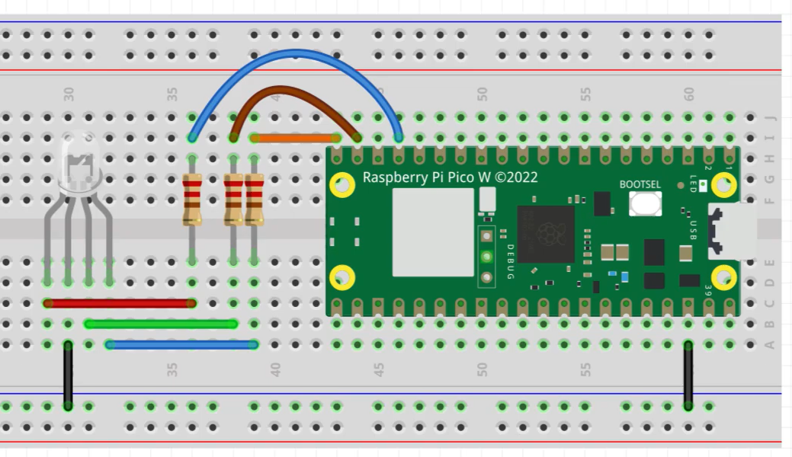
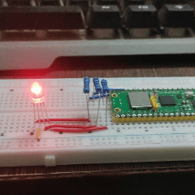

##### Preview:  
  
  
```python
from machine import Pin, PWM
from time import sleep

redPin = 15
greenPin = 14
bluePin = 13

redLED = PWM(Pin(redPin))
greenLED = PWM(Pin(greenPin))
blueLED = PWM(Pin(bluePin))

redLED.freq(1000)
redLED.duty_u16(0)

greenLED.freq(1000)
greenLED.duty_u16(0)

blueLED.freq(1000)
blueLED.duty_u16(0)

while True:
    # Red term    
    redBright = 65550
    greenBright = 0
    blueBright = 0
    
    redLED.duty_u16(redBright)
    greenLED.duty_u16(greenBright)
    blueLED.duty_u16(blueBright)
    
    sleep(0.5)
    
    # Green term    
    redBright = 0
    greenBright = 65550
    blueBright = 0
    
    redLED.duty_u16(redBright)
    greenLED.duty_u16(greenBright)
    blueLED.duty_u16(blueBright)
    
    sleep(0.5)
    
    # Blue term    
    redBright = 0
    greenBright = 0
    blueBright = 65550
    
    redLED.duty_u16(redBright)
    greenLED.duty_u16(greenBright)
    blueLED.duty_u16(blueBright)     
    
    sleep(0.5)    
```  
  